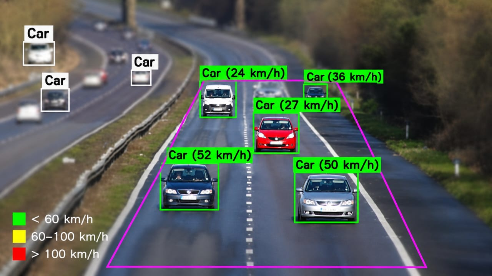
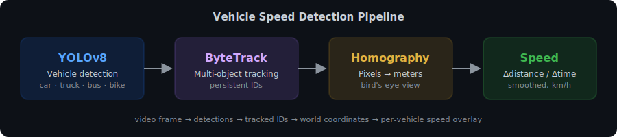

# 🚗 Vehicle Speed Detection with YOLOv8

Real-time traffic analytics that detects vehicles in road video, tracks them across frames, and estimates each vehicle's speed in km/h — with color-coded overlays (green / yellow / red) rendered directly on the output video.


## 📸 Demo

<!-- Replace these with your own screenshots after running the pipeline -->
<p align="center">
  
</p>
<p align="center"><em>Detected vehicles with per-vehicle speed labels. Green &lt; 60 km/h · Yellow 60–100 km/h · Red &gt; 100 km/h</em></p>

<p align="center">
  
</p>

## ⚙️ How It Works

The pipeline has four stages:

| Stage | Component | What it does |
|---|---|---|
| 1. Detection | **YOLOv8** | Detects cars, trucks, buses, motorcycles per frame |
| 2. Tracking | **ByteTrack** | Assigns a persistent ID to each vehicle across frames |
| 3. Perspective transform | **OpenCV homography** | Maps image pixels → real-world meters (bird's-eye view) |
| 4. Speed estimation | Sliding window | Speed = distance (m) / time (s) × 3.6, smoothed over ~0.7 s |

Key detail: the **bottom-center of each bounding box** is used as the vehicle's position — that's where the tires touch the road plane, which is what the homography assumes.

### Robustness guards

Naive speed estimation produces absurd values (10,000+ km/h). This implementation includes four guards:

1. **Calibration-zone gating** — speed is only computed inside the calibrated road polygon; outside it the homography extrapolates and diverges near the horizon.
2. **Teleport rejection** — a jump of more than `MAX_STEP_M` meters in one frame indicates a tracker ID switch; the track history is reset.
3. **Minimum time window** — estimates are only trusted after `MIN_DT_SECONDS` of track history, since tiny time deltas amplify pixel noise.
4. **Plausibility cap** — speeds above `MAX_PLAUSIBLE_KPH` are discarded as noise.

## 🚀 Quick Start

### Google Colab (recommended)

1. Open a new notebook, set **Runtime → Change runtime type → GPU**
2. Install dependencies and run:

```bash
!pip install -q ultralytics opencv-python numpy
!python vehicle_speed.py
```

3. Upload your road video as `input.mp4` (or change `VIDEO_PATH` in the script)
4. Download the annotated `output_speed.mp4`

### Local

```bash
git clone https://github.com/<your-username>/vehicle-speed-detection.git
cd vehicle-speed-detection
pip install -r requirements.txt
python vehicle_speed.py
```

### 🎥 Live Webcam / IP Camera Mode

`vehicle_speed_webcam.py` runs the same pipeline on a live camera feed (local machine only — Colab cannot access your webcam):

```bash
python vehicle_speed_webcam.py                     # default webcam
python vehicle_speed_webcam.py --source 1          # second camera
python vehicle_speed_webcam.py --source "rtsp://user:pass@ip:554/stream"  # IP/CCTV camera
```

- Speeds are computed from **wall-clock time**, not the camera's reported FPS, so they stay accurate even when processing lags
- The calibration zone is drawn live in magenta so you can aim the camera and line it up with the road
- Hotkeys: **R** starts/stops recording annotated footage to `output_webcam.mp4`, **Q** quits
- Uses `yolov8n.pt` by default for real-time CPU performance — switch to `yolov8s`/`m` in the script if you have a GPU

Calibrate `SOURCE` and `TARGET_WIDTH/HEIGHT` in the script for your camera view, same as the video version.

## 📐 Calibration (Required for Accurate Speeds)

Speed accuracy depends entirely on the **homography calibration**. You must tell the script where the road is in your video and how big it is in real life.

In `vehicle_speed.py`, edit:

```python
SOURCE = np.array([
    [tl_x, tl_y],   # far-left edge of lanes  (top of image)
    [tr_x, tr_y],   # far-right edge of lanes
    [br_x, br_y],   # near-right edge of lanes (bottom of image)
    [bl_x, bl_y],   # near-left edge of lanes
], dtype=np.float32)

TARGET_WIDTH  = 7.3    # real width in meters (lanes × ~3.5 m)
TARGET_HEIGHT = 60.0   # real length in meters
```

**Tips for picking values:**

- Lane width is ~3.5 m in most countries (~3.65 m in the UK)
- Dashed lane markings are a free ruler: one stripe + gap cycle ≈ 9 m on normal roads (longer on motorways)
- The script draws the calibration zone in **magenta** on the output — check that it sits flat on the road where vehicles drive
- If all speeds are off by a consistent factor, adjust `TARGET_HEIGHT`
- ⚠️ Sped-up / timelapse footage inflates all speeds by the speedup factor — use real-time video

## 🔧 Configuration

| Setting | Default | Description |
|---|---|---|
| `MODEL_NAME` | `yolov8m.pt` | YOLOv8 variant (`n`/`s`/`m`/`l` — bigger = more accurate, slower) |
| `CONF_THRES` | `0.3` | Detection confidence threshold |
| `SMOOTH_SECONDS` | `0.7` | Speed smoothing window |
| `MIN_DT_SECONDS` | `0.4` | Minimum track time before showing a speed |
| `MAX_STEP_M` | `4.0` | Max plausible per-frame movement (teleport guard) |
| `MAX_PLAUSIBLE_KPH` | `200` | Hard cap on reported speeds |

## 📁 Project Structure

```
vehicle-speed-detection/
├── vehicle_speed.py         # Main pipeline for video files (detection → tracking → speed)
├── vehicle_speed_webcam.py  # Live webcam / RTSP camera version with recording hotkey
├── requirements.txt
├── assets/              # README images (add your own screenshots here)
│   └── pipeline.svg
└── README.md
```

## 🛣️ Roadmap / Ideas

- [ ] Automatic camera calibration from lane markings
- [ ] Per-lane vehicle counting and average-speed statistics
- [ ] CSV/JSON export of per-vehicle logs
- [x] Live RTSP/webcam stream support
- [ ] Speeding-violation snapshots with license plate crops

## 📄 License

MIT — free to use, modify, and distribute.

## 🙏 Acknowledgements

- [Ultralytics YOLOv8](https://github.com/ultralytics/ultralytics)
- [ByteTrack](https://github.com/ifzhang/ByteTrack)
- OpenCV
